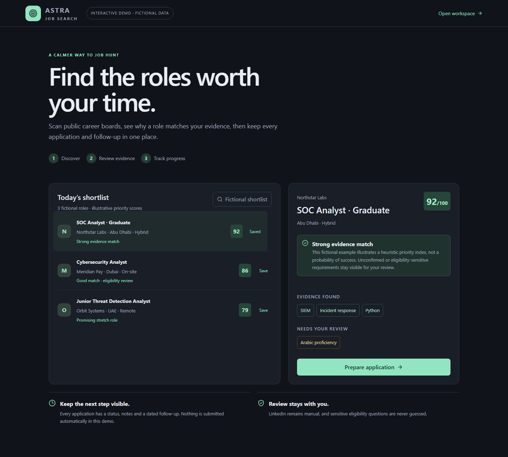
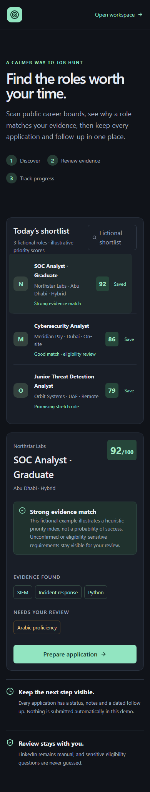

# ASTRA

A local job-search workspace: discover public listings, review evidence, prepare
application documents, and track follow-ups. **You submit applications yourself.**
Built by Ayham as a portfolio project; this is not a claim of professional production experience.

Stored locally by default. Discovery contacts configured public job APIs. Optional
OpenAI commentary sends the selected job description and listed skills only after
per-request approval; those texts can contain information you entered. Rules mode
needs no AI service. Ollama stays on loopback. Manual employer links leave ASTRA.

## Try the product

Run locally, then open [fictional demo](http://localhost:8787/demo). The demo has no
real applications. Never expose the private backend online. To serve only the demo,
set `ASTRA_DEMO_ONLY=1` before starting: every `/api` route is then disabled.





## Windows installation

Reference configuration: Windows x64, **Python 3.13.2**, **Node 24 LTS for source builds**.
Python 3.14 is a CI verification target; continuous verification is pending. No administrator rights are required.
Install Python from [python.org](https://www.python.org/downloads/windows/) and Node
from [nodejs.org](https://nodejs.org/en/download). Keep the project outside cloud-synced folders.

1. Clone the repository (or extract the release ZIP into a new local directory).
2. Double-click `setup.bat`.
3. Double-click `run.bat`, then open the displayed localhost address.

A release ZIP includes the built frontend: **Node is not needed for release users**.
Python and Internet access for hash-verified package installation are still required.
Setup creates an empty workspace and never imports nearby CVs or trackers. Existing
records survive rerunning setup. Use `stop.bat` to stop this installation's server.
An existing Python 3.12 environment needs recreation with a supported baseline;
back up data first. Do not move a virtual environment from another installation.

Optional offline browser rehearsal/tests require:
`.venv\Scripts\python.exe -m playwright install chromium`.
Normal discovery, tracking and document preparation do not need Chromium.

## Everyday workflow

Choose your career focus and locations. Upload a text PDF CV, review extracted facts,
then confirm them. Scan configured public boards or paste a job description.
Review the match explanation, prepare documents, and check every claim. Open the
employer page in your own browser, apply manually, then record status and follow-ups.
SQLite is authoritative; the Excel tracker is a local mirror. Close Excel if sync is pending.
Discovery is manual only: nothing scans when Windows or ASTRA starts, on a timer, or after a
restart. Press **Start Scan** in Discovery, review the scope and expected workload, then confirm.
A running scan shows its progress and can be stopped before its next source.

## Security evidence

- Loopback, Host, Origin and cross-site request controls with adversarial regressions.
- Bounded PDF child process: 512 MiB Windows Job Object and 20-second timeout.
  This is resource isolation, not a full OS sandbox or malware detector.
- SSRF validation on requests and redirects; formula-safe spreadsheet export.
- Native credential storage, bounded local security events, and a visible self-check.
- Optional access-key exchange with expiring browser sessions and private-screen cleanup.
- Persistent OpenAI request limits, bounded input/output and no automatic retries.
- Hash-checked Python wheels, npm lock, CycloneDX inventory and pinned CI actions.

ASTRA's Secure SDLC is mapped to NIST SSDF 1.1, with an application-specific
OWASP ASVS 5.0.0 assessment and a conservative OWASP SAMM v2 review.
Release SBOMs use validated CycloneDX 1.7; the SLSA v1.2-aligned hosted provenance
workflow is prepared but has not executed. **Public release is blocked** until
requirement gaps and remote assurance checks are closed.

[Secure SDLC](docs/security/SECURE_SDLC.md) | [ASVS](docs/security/OWASP_ASVS_5.0.0_MAPPING.md) |
[SSDF](docs/security/NIST_SSDF_1.1_MAPPING.md) | [SAMM](docs/security/OWASP_SAMM_V2_ASSESSMENT.md) |
[Release assurance](docs/release/RELEASE_SECURITY_ASSURANCE_REPORT.md)

[Architecture](docs/SECURITY_ARCHITECTURE.md) · [Threat model](docs/THREAT_MODEL.md) ·
[Security evidence](docs/SECURITY_POSTURE.md) · [Risks](security/RISK_REGISTER.md) ·
[Security policy](SECURITY.md) · [Portfolio demo](docs/PORTFOLIO_DEMO.md)

## Verify and build

```text
.venv\Scripts\python.exe -m backend.doctor
.venv\Scripts\python.exe -m pytest -q
cd frontend
npm ci
npm test
npm run build
npm audit --audit-level=low
cd ..
.venv\Scripts\python.exe scripts/publication_gate.py
.venv\Scripts\python.exe scripts/build_release.py --sbom release/astra-1.0.0-rc.1.cdx.json
```

[Reproducible builds](docs/REPRODUCIBLE_BUILD.md) documents dependency audits and
release checks. Release ZIPs include a manifest and SHA-256 checksum, exclude private
data and Git history, and are never published automatically.

## Limits

Single trusted user, localhost only. Files and SQLite are not encrypted by ASTRA;
use OS account protection and disk encryption. Default keyless mode accepts local
callers without establishing OS-user identity; this remains a strict L1 release
blocker. [Local access](docs/security/LOCAL_ACCESS.md) explains optional protection
and browser-session changes. No live configuration was migrated in this pass.
DNS validation has a residual reconnect race. Deletion is app-scoped and cannot erase
exports, OS backups or SSD remnants. AI commentary can be wrong; it has no tools and
cannot approve facts or submit applications. PDF extraction is text-only and supports
limited headings; review omissions. Docker/Linux installation is unverified.

MIT licensed. Preserve [third-party notices](THIRD_PARTY_NOTICES.md).

Generate the SBOM in the separate hash-installed assurance environment first; see [SBOM process](docs/security/SBOM.md).
