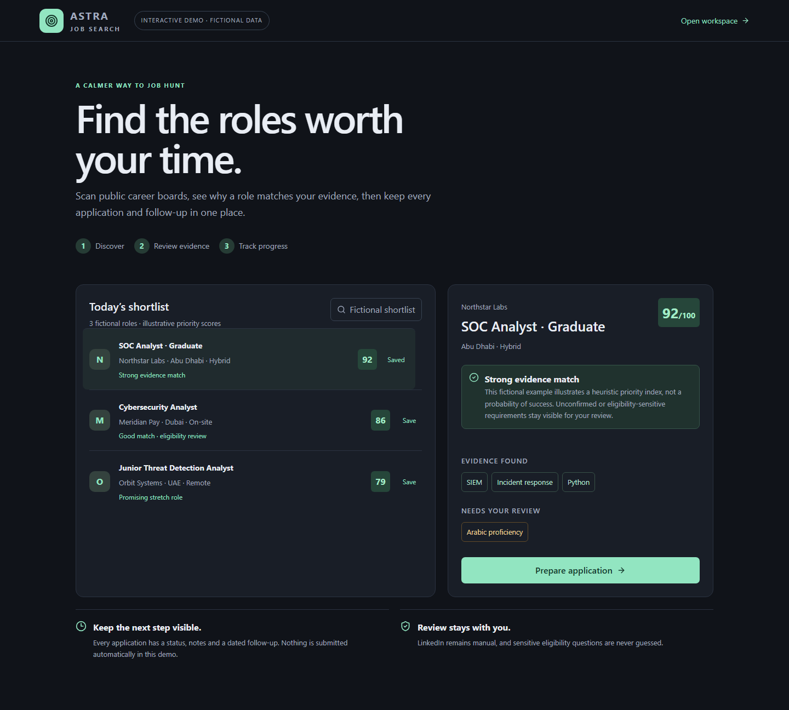

# ASTRA · Job search, with a clearer next step

**Discover relevant roles. Review the evidence. Keep your applications moving.**

ASTRA brings job discovery, CV review, application preparation and follow-up
tracking into one local workspace. Built by Ayham, a cybersecurity graduate,
as an AI-assisted personal portfolio project with documented security controls.

**Early beta · v1.1.0-beta.2 candidate (not yet published).** Expect rough edges. Features and validation are
still developing; this is not a production assurance or universal matching claim.
**You review facts and submit applications yourself.**

[**Download the Windows beta ZIP**](https://github.com/SoSwag5/ASTRA/releases/download/v1.1.0-beta.1/astra-1.1.0-beta.1.zip)
· [Installation guide](docs/GETTING_STARTED.md)
· [Upcoming beta changes](docs/release/V1_1_0_BETA_2_NOTES.md)
· [Roadmap](docs/ROADMAP.md)
· [Report a bug](https://github.com/SoSwag5/ASTRA/issues/new/choose)

The download above is the published **beta 1**. The beta 2 improvements on this
branch are not yet in that ZIP. Each release page identifies its shipped source,
checksum and executed assurance evidence.

## What you can do

- **Discover:** search configured public Greenhouse, Lever and Ashby boards;
  preview a scan, start it manually and stop it. Nothing scans automatically.
- **Understand:** review explainable fit and eligibility separately. A fit score
  is a prioritization signal, not a hiring probability.
- **Prepare:** import a text PDF CV, correct extracted facts and confirm them;
  prepare documents and review every claim before use.
- **Track:** record applications and follow-ups. Optional primary-account Gmail
  sync suggests confirmations; uncertain matches require review.
- **Work comfortably:** cohesive light/dark pages, responsive layouts, loading
  feedback, page transitions and motion that respects reduced-motion preferences.

After launch, open [your workspace](http://localhost:8787/) to use your own CV.
The [fictional demo](http://localhost:8787/demo) is optional. Choose **Use my own
CV** to leave it. These screenshots show made-up data, not live records.

## Install in five steps

Windows x64. Internet is needed during installation; Python 3.13 is required.
The ZIP includes the built interface. **Release users need no Git, Node, paid
AI subscription or administrator access for ASTRA.** This beta is a Python-based
ZIP application, not a standalone signed Windows installer.

1. Download **astra-1.1.0-beta.1.zip** from the beta release's Assets section.
   GitHub's automatically generated **Source code** downloads are for developers.
2. Right-click the ZIP, choose **Extract All**, and open the extracted `astra` folder.
3. Open **START HERE.html**. If needed, follow its official Python installation link.
4. Double-click **Install ASTRA.bat**. Keep the window open until it says **Ready**.
5. Double-click **Open ASTRA.bat**. Your browser opens your local workspace.

Keep the folder outside OneDrive or other cloud-synced folders. Follow setup,
review your imported CV and choose your career focus. The demo is optional.
[Full instructions, troubleshooting and safe updates](docs/GETTING_STARTED.md).

## Your data and your decisions

CVs, jobs and application records are stored locally by default. Discovery
contacts configured public job services. Rules mode needs no AI service.
Optional OpenAI commentary sends selected job text and listed skills only after
per-request approval; Ollama uses loopback. Employer links open external sites.

Gmail is optional and advanced: its read-only OAuth permission covers the
**whole connected mailbox**, although ASTRA narrows its queries. This beta
supports one primary account; secondary-account controls are disabled. Live
mailbox accuracy and multi-account behaviour have not been validated. Read
[the Gmail boundary](docs/security/THREAT_MODEL_CHANGE_V1_1_DISCOVERY_GMAIL.md) before connecting.

Use a trusted Windows account and disk encryption. ASTRA does not encrypt its
SQLite database or isolate you from other processes running as your OS user.
PDF resource limits are containment, not malware detection. CV extraction has
support for common section headings and still needs human correction. Cross-major import tests
do not establish ranking quality across careers. Linux and Docker installation
are unverified. See [known risks](security/RISK_REGISTER.md).

## Security work you can inspect

The project includes threat modelling, local request controls, bounded PDF
parsing, SSRF checks, credential-store integration, adversarial regressions,
hash-locked dependencies, a CycloneDX 1.7 SBOM and fail-closed release workflows.
Mappings to OWASP ASVS 5.0.0, NIST SSDF 1.1 and OWASP SAMM describe scoped
engineering evidence. **No certification, compliance or SLSA Build level is claimed.**

[Beta evidence](docs/release/V1_1_0_BETA_1_EVIDENCE.md)
· [Architecture](docs/SECURITY_ARCHITECTURE.md)
· [Threat model](docs/security/THREAT_MODEL.md)
· [Security policy](SECURITY.md)
· [Secure SDLC](docs/security/SECURE_SDLC.md)

## Develop and contribute

Source builds require Python 3.13 and Node 24 LTS; Python 3.14 is also a CI target.
See [reproducible builds](docs/REPRODUCIBLE_BUILD.md),
[contribution guidance](CONTRIBUTING.md), [governance](docs/governance/README.md)
and [the changelog](CHANGELOG.md). Report bugs using fictional examples; never
attach CVs, mailbox contents, credentials or private databases to public issues.

[12 September to beta comparison](docs/project/DEVELOPMENT_2026_09_12_TO_BETA.md)
· [Independent cloud review prompt](docs/project/CLAUDE_CLOUD_BETA_REVIEW.md)
· [Another-PC acceptance checklist](docs/release/ANOTHER_PC_BETA_CHECKLIST.md)

MIT licensed. Preserve [third-party notices](THIRD_PARTY_NOTICES.md).
