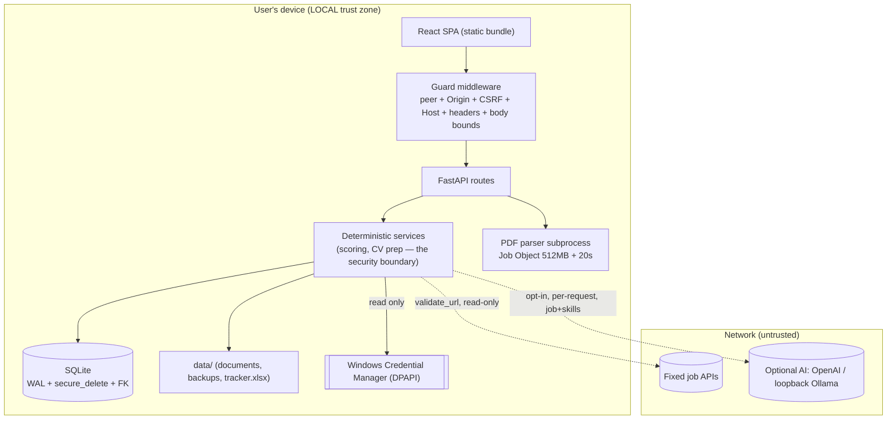

# ASTRA — Security Architecture

For technical reviewers. Complements [THREAT_MODEL.md](THREAT_MODEL.md) (what we
defend against) with *how* the system is built to be defensible.

## Local-first model

Everything runs on the user's machine. The backend (FastAPI + Uvicorn) binds to
`127.0.0.1`. The frontend is a static React bundle served by the same backend.
There is no server component, no multi-tenancy, and no account system — the
security model is "single trusted user on one device," and controls are scoped to
that reality rather than to an enterprise deployment.

## Request lifecycle & controls (in order)

1. **Transport / peer** — non-loopback client IP → 403.
2. **TrustedHostMiddleware** — `Host` not in allowlist → 400 (DNS-rebinding).
3. **Origin allowlist** — cross-origin `Origin` → 403.
4. **CSRF** — `Sec-Fetch-Site: cross-site` → 403.
5. **Optional token** — if `APP_TOKEN` set, constant-time bearer check.
6. **Body bounds** — Content-Length ≤ 11 MB; streaming/chunked mutation rejected;
   JSON or multipart only.
7. **Mutation serialization** — state-changing requests run under an async lock.
8. **Handler** — Pydantic validation, ORM (parameterized), domain checks.
9. **Response headers** — CSP, XFO DENY, nosniff, Referrer-Policy no-referrer,
   Permissions-Policy, Cache-Control no-store — on API **and** static responses.
10. **Errors** — exceptions collapse to a generic 500; DB exception dumps (which
    can contain private field values) never reach the client.

## Subsystem notes

- **File parsing:** `validate_document` (structural) → subprocess `pdf_worker`
  under a Windows Job Object (`JOB_OBJECT_LIMIT_PROCESS_MEMORY`, 512 MB) with a
  20 s wall-clock timeout. The worker has no network/shell and never emits document
  contents into error output.
- **Outbound fetch:** single `validate_url` choke point; automatic sources are 4
  fixed provider hosts; redirects revalidated; 5 MB response cap; `trust_env=False`.
- **Credentials:** `keyring` → Windows Credential Manager (DPAPI); fail-closed;
  never logged/echoed; excluded from exports.
- **Data at rest:** SQLite `secure_delete=ON`, WAL; deletion allowlists files and
  runs `wal_checkpoint(TRUNCATE)` + `VACUUM`. Not app-encrypted (delegated to OS
  FDE).
- **Excel:** formula-injection `safe()`; atomic temp-file replace; DB commit
  precedes the Excel mirror so an Excel failure never loses application data.
- **AI:** untrusted-output model with no tools; output schema-validated; consent
  per request; deterministic code authorizes all consequential actions.
- **Demo:** `/demo` serves the same static shell with fictional client-side data;
  it does not expose a separate privileged data path.
