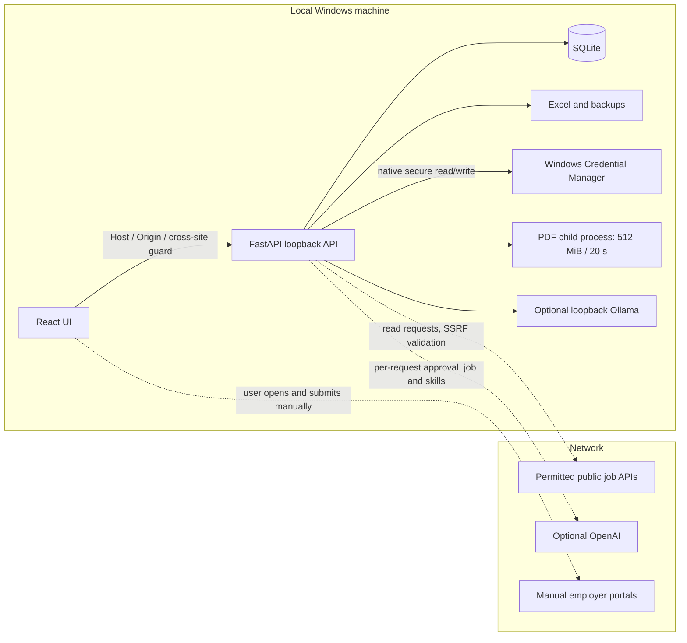

# Architecture

The PDF child has resource limits, not network/filesystem isolation against arbitrary
native code execution. Windows Credential Manager stores encrypted credential material;
ASTRA never stores a plaintext key in its database or export. Loopback API access by
another same-user process is a documented residual risk. `/demo` is a fictional UI;
only `ASTRA_DEMO_ONLY=1` disables every private API route at the server boundary.
