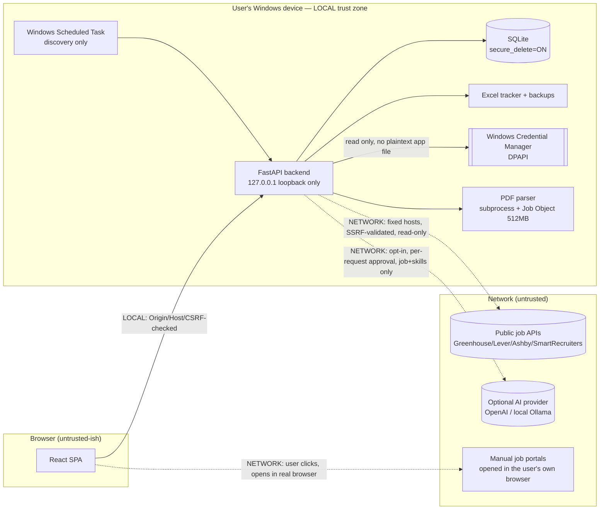

> Current verification and corrections: [release report](RELEASE_CANDIDATE_REPORT.md).

# ASTRA — Threat Model

*Last reviewed: 2026-09-12. Scope: the local-first ASTRA job-search workspace
(FastAPI + SQLite backend, React/TypeScript frontend, optional AI provider).*

This document is written for technical reviewers. It states what ASTRA protects,
who might attack it, where the trust boundaries are, and which assumptions are
explicitly out of scope. Findings and verification evidence live in
[SECURITY_POSTURE.md](SECURITY_POSTURE.md); residual risks live in
[../security/RISK_REGISTER.md](../security/RISK_REGISTER.md).

## 1. Assets

| Asset | Sensitivity | Where it lives |
|---|---|---|
| Master CV (PDF) | High (PII) | `data/master.pdf` |
| Extracted CV text + parsed profile | High (PII) | SQLite `candidate_profiles`, `skills`, … |
| Contact details (name/email/phone) | High (PII) | SQLite `candidate_profiles` |
| Application history & recruiter notes | Medium/High | SQLite `applications`, `follow_ups`, `application_events` |
| Job-search preferences / career focus | Medium | SQLite `settings` |
| Excel tracker + backups | High (mirror of the above) | `data/tracker.xlsx`, `data/backups/` |
| Generated CVs / cover letters | High | `data/documents/` |
| OpenAI API credential | High (secret) | Windows Credential Manager (DPAPI), native encrypted OS storage |
| Local database | High | `data/hunter.db` (+ `-wal`, `-shm`) |

## 2. Actors / threat sources

| Actor | Capability assumed |
|---|---|
| Legitimate local user | Full, trusted |
| Malicious website in the user's browser | Can issue cross-origin requests to `localhost`; cannot read cross-origin responses |
| Malicious job listing / web content | Supplies untrusted HTML, titles, descriptions, URLs that ASTRA ingests |
| Malicious uploaded document | Crafted PDF/XLSX (active content, archive bomb, traversal) |
| Compromised dependency | Malicious code in a Python/npm package |
| Other low-privileged local process/account | Can attempt to reach the loopback API or read files |
| AI prompt-injection attacker | Embeds instructions inside job/CV text hoping the model acts on them |
| Future GitHub contributor / repo viewer | Reads the public source and history |

## 3. Trust boundaries (data-flow diagram)

Solid arrows are LOCAL; dashed arrows CROSS THE NETWORK. The privacy boundary a
reviewer cares about: **by default (rules mode) no CV data crosses a dashed AI
arrow at all.** See [PRIVACY_DATA_FLOW.md](PRIVACY_DATA_FLOW.md).

## 4. Key trust-boundary controls (summary)

- **Browser → API:** loopback-only peer check, `Origin` allowlist, `Sec-Fetch-Site`
  CSRF guard, `Host` allowlist (TrustedHostMiddleware, blocks DNS rebinding),
  strict CSP, `X-Frame-Options: DENY`.
- **API → filesystem:** `resolve()` + `is_relative_to()` path containment on
  downloads; deletion/export operate only on a recognized allowlist of files and
  refuse if the data folder contains links or unknown entries.
- **API → network (outbound):** `validate_url` blocks non-HTTP(S) schemes,
  credentials-in-URL, non-80/443 ports, and any host resolving to a
  non-global IP (loopback, RFC1918, link-local, cloud metadata); revalidated on
  every redirect. Automatic sources use fixed provider hosts only.
- **API → credential store:** read/write via the native OS keychain; fails closed
  with no plaintext fallback.
- **Document parsing:** structural validation before parsing; parsing runs in a
  separate process capped by a Windows Job Object (512 MB) with a 20 s timeout.
- **AI:** treated as untrusted *output*; deterministic code is the security
  boundary; the model has no tools and cannot trigger any action.

## 5. Explicit security assumptions (out of scope)

1. **The Windows user account is trusted.** If that account is fully compromised,
   ASTRA cannot guarantee confidentiality of local files against that attacker —
   local files and SQLite are **not** encrypted by the application. Mitigation is
   OS account security + full-disk encryption (BitLocker), which is the user's
   responsibility and is stated in-app.
2. **The application is single-user and loopback-only.** It is not designed for
   multi-user or network exposure. Public binding requires an explicit
   `APP_TOKEN` and is unsupported for daily use.
3. **Dependency auditing reduces but does not eliminate supply-chain risk.** A
   clean `pip-audit`/`npm audit` proves no *known* advisories, not that a package
   is non-malicious.
4. **"Deletion" is app-scoped.** It cannot erase OS backups, cloud-synced copies,
   filesystem snapshots, or SSD remnants. No claim of forensic erasure is made.
5. **Prompt-injection defense is architectural, not perfect.** The model may still
   produce wrong commentary; the guarantee is that it cannot *act* — every
   consequential action requires deterministic code + explicit user authorization.
